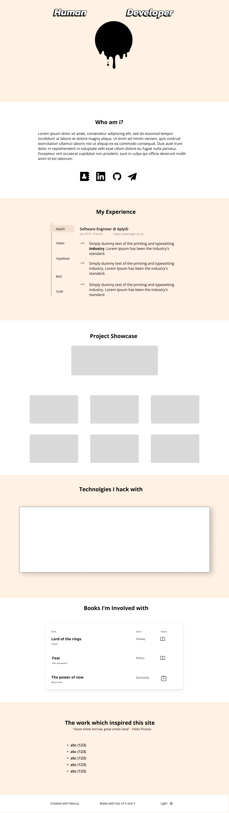

# James Watt Portfolio

## ToDo
- Remove redundant global CSS
- Complete Books section
- Complete Credits section
  - Consider some different designs
- Complete footer
- Complete Technologies section
  - Complete draft design in figma
  - If draft design looks good then implement otherwise hold off and do credits
  - Consider not having a technologies section
- Mess around with different fonts
- Ensure website works fine on mobile
- Decide on a dark mode theme and implement it
- Complete Landing section
  - Understand how the wave and drop code works
  - Potentially add code for x offset so I can postion drop impact
  - Document how the wave and drop code works in a blog
  - Create SVG "Human Developer" text in Gimp
  - Decide what I want the main image to look like
  - Inspiration for custom images include
    - https://www.youtube.com/watch?v=v0hhwAMLnzU&ab_channel=DaviesMediaDesign
- Update all styles to be mobile first then apply larger styles at bigger breakpoints as per tailwind docs. Make sure to read tailwind docs on responsive design first as this site is desktop first.
- Clean up raw CSS files
- Check all semi colon usgae
- Check all single quote usage
- No hanging commas
- Update linter with stricter rules so evrything can be formatted nicley. Emphasis on styling long class names
- Consider overall site theme perhaps in relation to eventual landing section colors

### Work Experience Section
- Clean up tab selection javascript
- Clean up and carefully check tailwind css classes
- Think about possible alternative component splits

### Bookshelf Section
- Refactor react code
- Consider alternative component splits